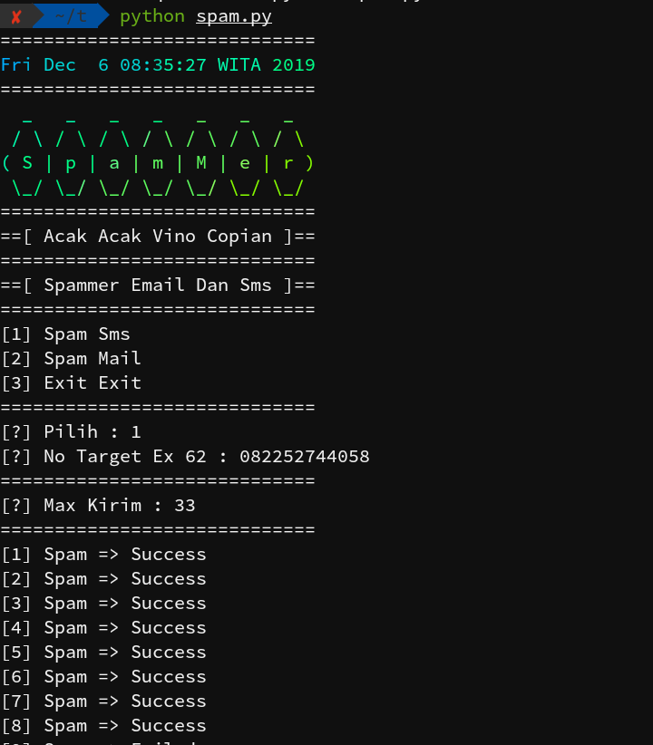

# Spam

```
Spammer Sms Dan Email
```

# Cara Install
```
pkg update
pkg upgrade
pkg ruby
pkg install python
gem install lolcat
pip install requests
git clone https://github.com/darkness09/Spam.git
cd Spam
ls
python spam.py
```


